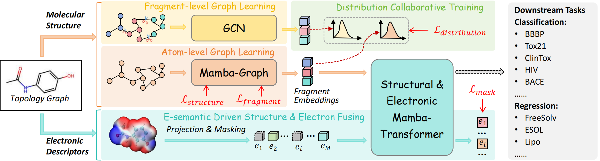

# MOL-Mamba: Enhancing Molecular Representation with Structural & Electronic Insights

The paper is accepted by AAAI 2025.

_Hefei University of Technology, Hefei Comprehensive National Science Center, Anhui Zhonghuitong Technology Co., Ltd._

#### [\[arXiv\]](xxx) | [\[PDF\]](xx)

## Abstract

Molecular representation learning plays a crucial role in various downstream tasks, such as molecular property prediction and drug design. To accurately represent molecules, Graph Neural Networks (GNNs) and Graph Transformers (GTs) have shown potential in the realm of self-supervised pre-training. However, existing approaches often overlook the relationship between molecular structure and electronic information, as well as the internal semantic reasoning within molecules. This omission of fundamental chemical knowledge in graph semantics leads to incomplete molecular representations, missing the integration of structural and electronic data. To address these issues, we introduce MOL-Mamba, a framework that enhances molecular representation by combining structural and electronic insights. MOL-Mamba consists of an Atom & Fragment Mamba-Graph (MG) for hierarchical structural reasoning and a Mamba-Transformer (MT) fuser for integrating molecular structure and electronic correlation learning. Additionally, we propose a Structural Distribution Collaborative Training and E-semantic Fusion Training framework to further enhance molecular representation learning. Extensive experiments demonstrate that MOL-Mamba outperforms state-of-the-art baselines across eleven chemical-biological molecular datasets. 

## Approach

---

## Data preparation

- For **train datasets** from [Oh et al. ECCV 2018](https://github.com/12dmodel/deep_motion_mag), see the official repository [here](https://drive.google.com/drive/folders/19K09QLouiV5N84wZiTPUMdoH9-UYqZrX?usp=sharing).

- For **Real-world datatsets**, we used three settings:

  - [Static Dataset](https://drive.google.com/drive/folders/1Bm3ItPLhRxRYp-dQ1vZLCYNPajKqxZ1a)

  - [Dynamic Dataset](https://drive.google.com/drive/folders/1t5u8Utvmu6gnxs90NLUIfmIX0_5D3WtK)

  - [Fabric Dataset](http://www.visualvibrometry.com/cvpr2015/dataset.html) from [Davis et al. CVPR 2015 && TPAMI](http://www.visualvibrometry.com/publications/visvib_pami.pdf)

- Real-world videos (or any self-prepared videos) need to be configured via the following:

  - Check the settings of val_dir in **config.py** and modify it if necessary.

  - To convert the **Real-world video** into frames:
    `mkdir VIDEO_NAME && ffmpeg -i VIDEO_NAME.mp4 -f image2 VIDEO_NAME/%06d.png`

    eg, `mkdir ./val_baby && ffmpeg -i ./baby.avi -f image2 ./val_baby/%06d.png`

> Tips: ffmpeg can also be installed by conda.

- Modify the frames into **frameA/frameB/frameC**:
  `python make_frameACB.py `(remember adapt the 'if' at the beginning of the program to select videos.)

> Tips: Thanks to a fellow friend [Peng Zheng](https://github.com/ZhengPeng7/motion_magnification_learning-based) for the help!

## Env

`pip install torch==1.9.0+cu111 torchvision==0.10.0+cu111 torchaudio==0.9.0 -f https://download.pytorch.org/whl/torch_stable.html einops`

## 🌐 Usage

### ⚙ Network Architecture

Our EulerMormer is implemented in `model/magnet.py`.

- For **Config:** `config.py`

- For **train:** `python main.py`

- For **test video:** `python test_video.py`

[Demo Baby](https://github.com/VUT-HFUT/EulerMormer/blob/main/fig/baby.avi)
[Demo Drum](https://github.com/VUT-HFUT/EulerMormer/blob/main/fig/drum.avi)
[Demo Cattoy](https://github.com/VUT-HFUT/EulerMormer/blob/main/fig/cattoy.avi)

## 🔖:Citation

If you found this code useful please consider citing our [paper](xxxx):

    xxx
